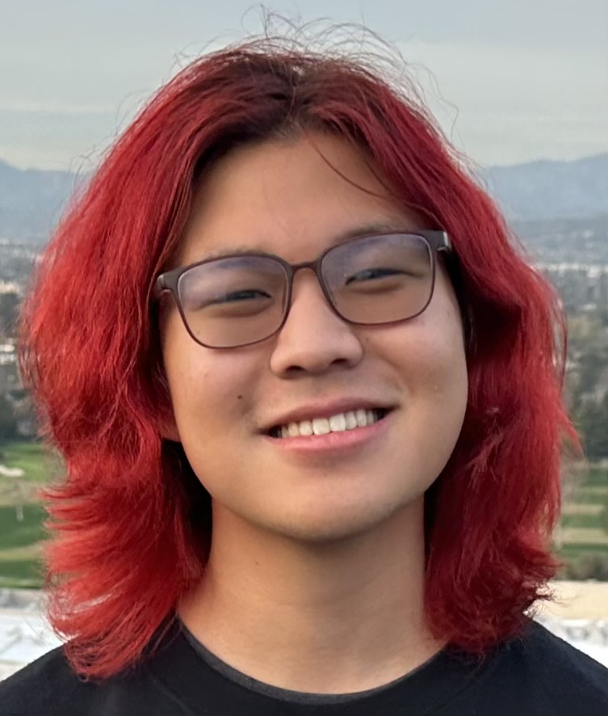

## bio
Justin Jung (he/they/she) is a first-year student at the University of Georgia pursuing a Bachelor of Arts in Entertainment and Media Studies with a minor in music.
 
Justin is an Eagle Scout, Zell Miller Scholar, and recipient of the Patrick S. Gilmore Band Award.
 
Post-graduation, Justin hopes to work in the film and media industry in either production or post-production to help share people's stories with a wider audience. If you'd like to see some of their work, feel free to browse his projects using the navigation bar above.
 
In his free time, Justin enjoys playing video games, reading, listening to music, and getting bubble tea.

### online presence:
+ [email](mailto:justin@bustinbung.com)
+ [github](https://github.com/bustinbung)
+ [instagram](https://instagram.com/bustinbung)
+ [twitter](https://twitter.com/bustinbung)
+ [snapchat](https://t.snapchat.com/kR0XK2AW)
+ [youtube](https://www.youtube.com/@bustinbung)
+ [spotify](https://open.spotify.com/user/31ww575syjxqf7h653q36evvbgeu?si=b48408449b544942)